# The Campervan Factory
(Developer: Jamie Phelps)

[Live Webpage](https://thephelpster.github.io/CI_PP1_CF/)

## Contents
Project Outline
Description
Aims
Target audience

Features
Existing Features
Future Features

Testing

Deployment

Credits

## Project Description

The Campervan Factory is where you can go to find information about what products the company offers. The site shows examples of the conversions that are produced, history of the company and the means to be able to get in contact to start the process of buying a campervan.

## Project Aims

### User Aims
* Finding a Campervan conversion they're confindent in
* Finding a breakdown of the conversion specs
* Finding the Companys history and background
* Finding the location of the Campervan Factory

### Company Aims
* Improve sales through clear and accesible site
* Improve customer communitcation through easy to use contact page
* Improve ease of locating the workshop
* layout information in a clear and easy to read manor

### Target Audience
* People looking to buy a VW Campervan
* People looking for previous customer experiences
* People wanting to visit the workshop location
* People wanting to sign up for the weekly newsletter

### User Expectations
* Easy to navigate site
* Simple layout on each page to make finding infomation quick
* Accessiblity
* Plently of pictures detailing the conversions
* Easy to use contact page with everyway to contact the company

# Features
## Existing Features
### favicon
The first feature on the website is the use of a favicon on every pages tab. the favicon is a much smaller version of the main company logo that changes depending on what decvice its being shown on.

 

### Navbar
The navbar has links to all pages and all links work when selected. I used the same design and sizing for the Navbar to keep a consitant feel to the site. The navbar also collapes when apearing on a different sized screen such as a mobile device.

### First Page Carousel
The carousel on the home page is the first feature you see aprt from the navbar. It cycles through the 3 images of the campervans giving the viewer an idea of what the campervans look like stright away. 

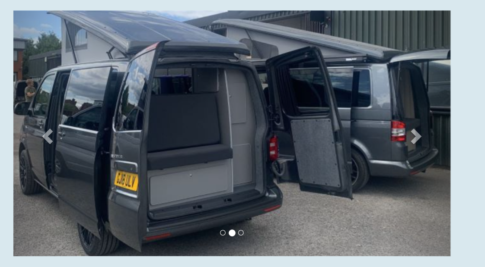

### Company Background Information and Background Image
This is the first paragraph of information explaining about the company and giving the customer a feel for what they are buying into. 

The paragraph is also acompanied by a background image that shows the workshop. The text is framed in a slightly see through box so the image behind is still visible but doesnt make the text hard to read.

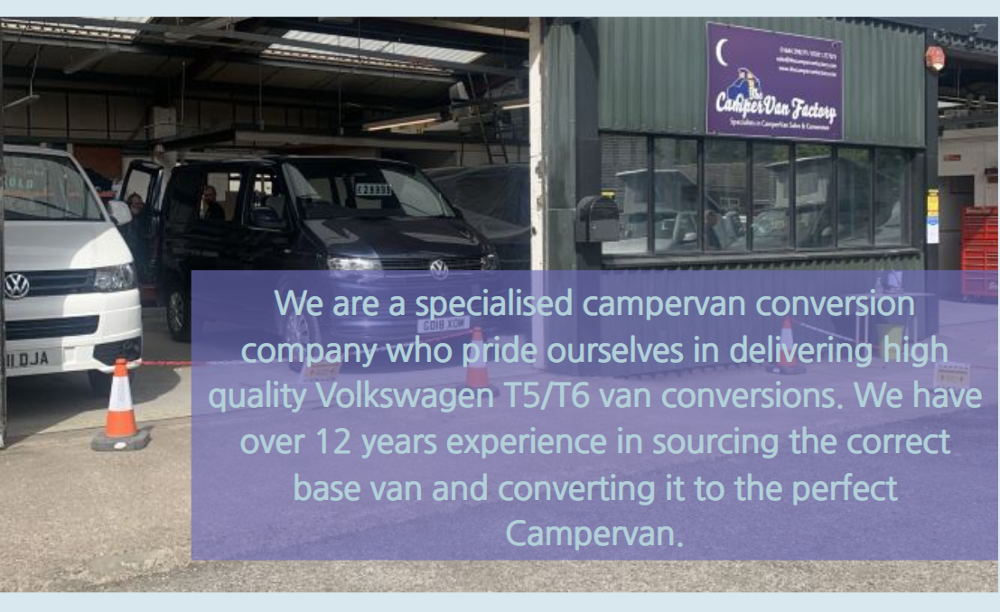

### Newsletter Signup
This section of page allows the viewer of the page to keep up to date with the latest information coming from the campervan factory. Its a good way for a potential customer to find out more information than what is avilable on the site. 

The newsletter form includes placeholder text, fields that must be completed and clearly marked labels for each field.

### Footer
The footer is made up of the social media links that the company uses to keep potential and exsiting customers up to date with any updates over multiple platforms reaching the most amount of people.

The footer is consitantly at the bottom of the each of the pages making it easy to find no matter which part of the site your on. 

### About Page Information
Most of this page is information based giving the viewer a better understanding of the company and giving them the reasurance that the conversions are built profesionally. I used background images to breakup the text to make the page more enjoyable to read through. 

The design has been mirrored from the perivous pages information section to add a sense of flow and consistancy.

### BBC Points West Interview Video
This video gives the site viewer and idea of the day to day workings of the factory and with it being shot during covid shows that the company was still busy even when no one could get out and use a campervan.

I left out autoplay on this particular video but included video controls so that the viewer of the website could control if and when they wanted to watch the video.

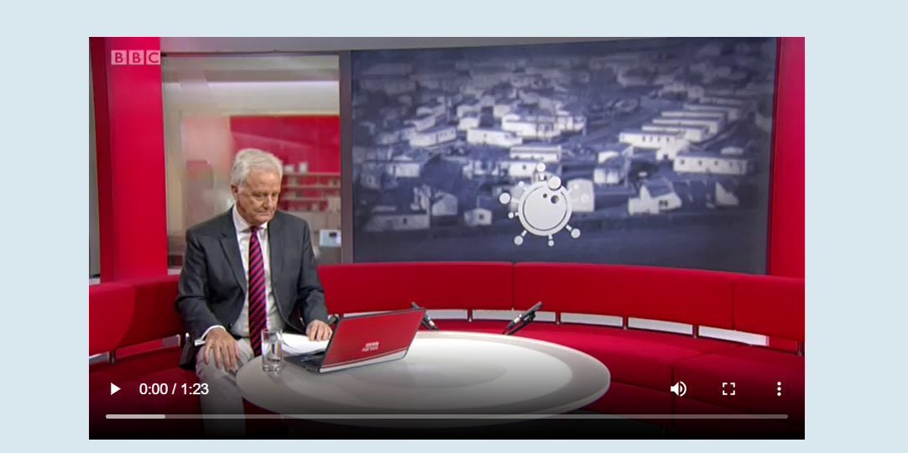

### The Conversion Page
the conversion page uses many of the exsiting features but in a different layout. this continues to help with the consistant feel of the website but sets out the information in a way that isnt too overwelming for the viewer. Elements that have been used again are text in coloured boxes, video element and a carousel. 

the video feature that is on this page uses the autoplay function but also uses the mute function as to not give a bad reaction to the page.

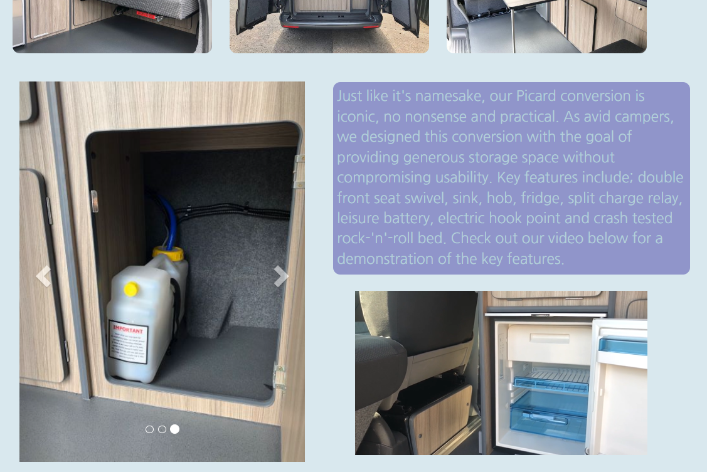

### Contact Table
On the contact page i used a table to layout the important contact information, making it easy and clear for the viewer to be able to find the information and get in contact with the company. using a table to compile the information will also make it easy for any future changes to be make such as changing the telephone numbers or email addresses.

### Contact Form
another way to contact the company is through the contact form i added to the page. this gives the viewer an even easier way to contact the company about any questions of concerns about buying a campervan from the campervan factory.

unlike the form on the first page this one includes a text box that the viewer can input any questions they want to ask.

### Google Map iframe
A google map iframe has been added to the bottom of the contact page giving the viewer the ability to find where the workshop is with ease. this allows the customers to be able to vist the workshop and get a first hand view of how the campervans are built and view any finished vans

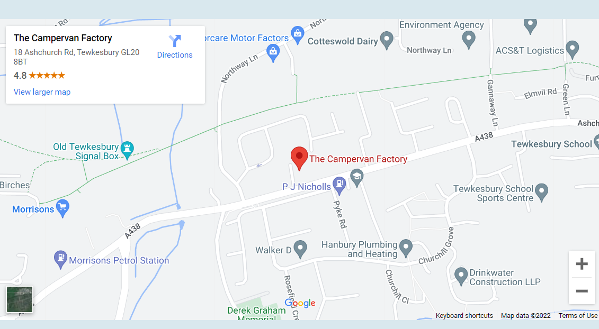

### Gallery Page
The gallery page also doubles as a review page to viewers of the site can see what exsiting customers think of the campervan theyve bought and been using. each review has corisponding images that were taken buy the customers showing off the campervans all over the world on differnt adventures.

## Future Features
to include a way of posting reviews on the page directly instead of the company doing manually. there are a few reasons for this. Firstly having the company post them up gives the impression that they are only putting up good reviews. Secondly it will take up less time for the owner of the site to keep adding reviews up manually.

# Design
## Design Style
### Colour Choices
when picking the colours I've used in this website i used the colorspace colour generator to help find colours that would complement each other on the screen. the base colours also had to be in keeping with the colours of the Campervan Factories sign that is visible in some of the images.

after i picked my base colours i then edited them slightly when called for such as sofening the colours and making the text box backgrounds slightly see through.

### Font Choices
to find the fonts i wanted to use, i searched through the google fonts webpage to find two fonts that were differnt enough from each other that its noticable but simular enough that they worked together well.

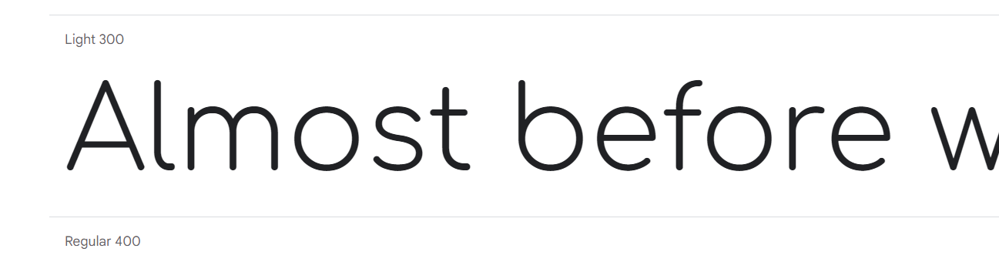
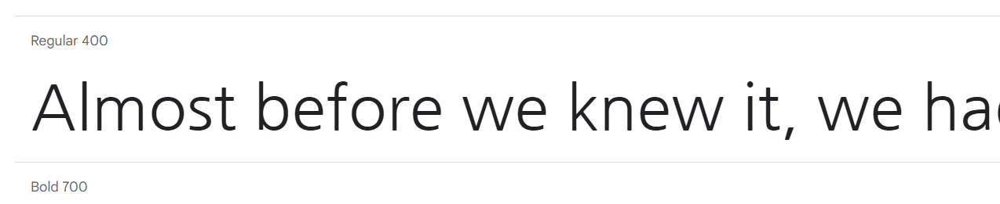

### Wireframes

Home

 
 

About

 
 

Conversions

 
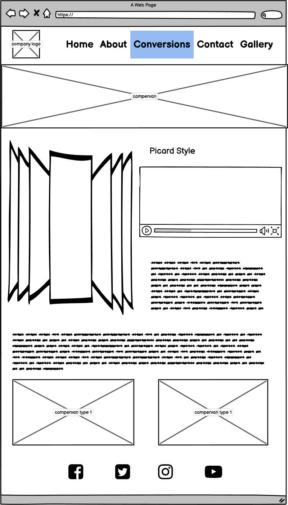 

Contact

 
 

Gallery

 
 

404 Error

 
 

# Testing
## Responsive Test
I put my website through the following validation tools:

### HTML 

Home

 
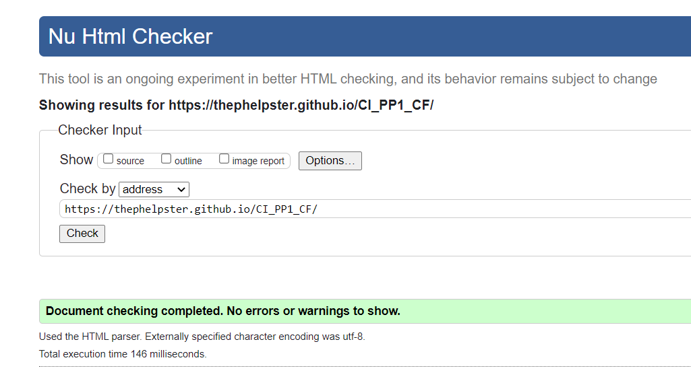>

About

 
>

Conversion

 
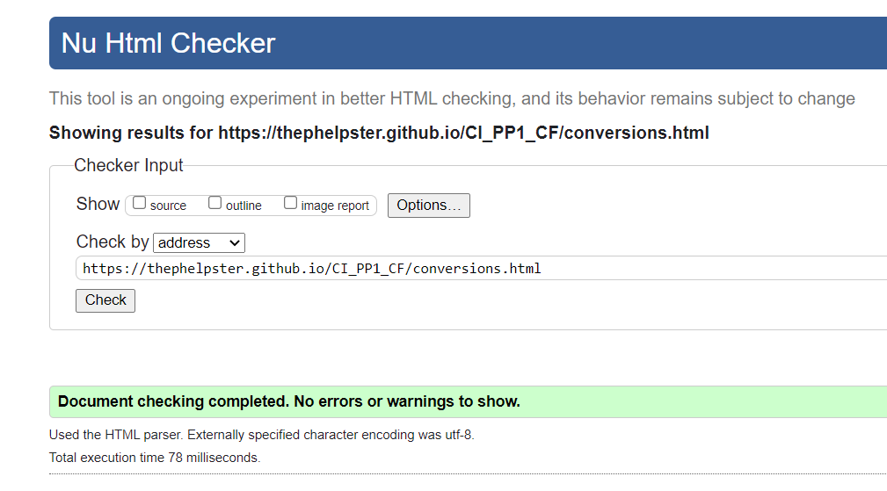>

Contact

 
>

Gallery

 
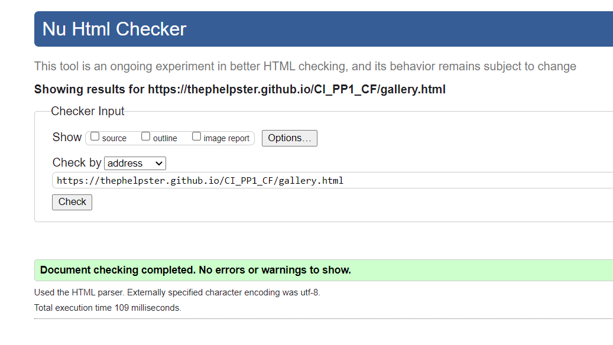>

404 Error

 
>

CSS: 

Accessibility: `https://wave.webaim.org/`

Performance: `https://developers.google.com/web/tools/lighthouse`

Mock up: `http://ami.responsivedesign.is/`

# Deployment

# Credits

https://mycolor.space/?hex=%23845EC2&sub=1
https://fonts.google.com/specimen/Comfortaa